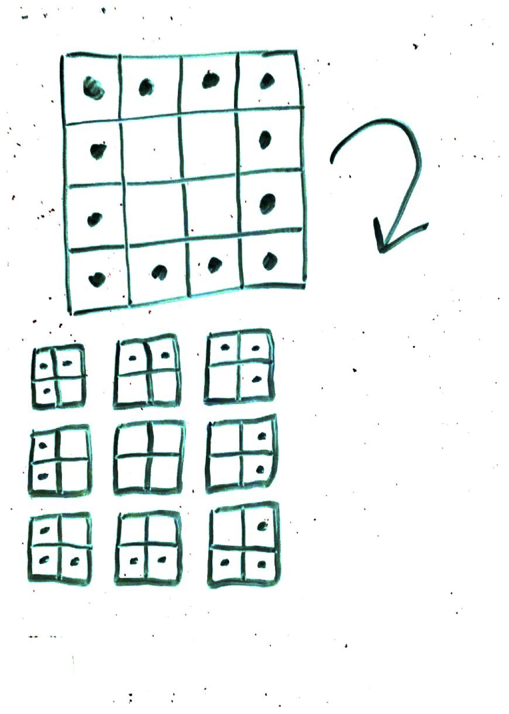

## Square Coloring

From Tyler Barron, where in the square?:

You are given an empty 4-by-4 square and one marker. You can color in the individual squares or leave them untouched. After you color as many or as few squares as you’d like, I will secretly cut out a 2-by-2 piece of it and then show it to you without rotating it. You then have to tell me where it was (e.g., “top middle” or “bottom right,” etc.) in the original 4-by-4 square.

Can you design a square for which you’ll always know where the piece came from?

Link: https://fivethirtyeight.com/features/can-you-construct-the-optimal-tournament/

## Solution Idea

Color in the outer edge of the 4x4 square

## Thinking

If we know the cutout will not be rotated, we can try to make a pattern so that every cutout is unique. It looks like there are nine possible cutouts that could be secretly made. We need to color it in so that if we are given a 2x2 portion of the 4x4 grid, we can know where it came from.

My first thought is to color the outer edge, so the only squares not filled in would be the four in the center. I think this will work to "point" towards the corners and let us know where each possible tile cutout came from.

I think this works. You use the marker as an arrow where the shaded squares point in the direction of the square's boundary. Even if they are sneaky and cutout the center, we will know it since it won't point anywhere (no squares filled in).